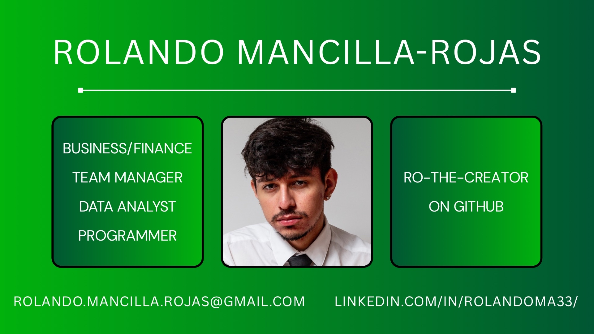

# `print('hello, world!')`

I'm Ro, and I'm a Data Strategist & Engineer, certified from The Marcy Lab School! I primarily stay up-to-date with business and finance, although I am also interested in many other fields. This includes music, literature, geography, and many more. If you'd like to connect, reach out to me via email or on my LinkedIn page below ↓

<!-- 

-->

  
  &nbsp;
  

 
  

## Tech Stack

##### The ones I'm confident in, not just exposure...

**Programming/Data Science/Cloud:** Python (Pandas, NumPy, SciPy, SciKit-Learn, PySpark), AWS

**Data Visualization/Databases:** Visualization (Tableau, Power BI, MatPlotLib, Seaborn), DBMS (SQLite, PostgreSQL, Access)

**Tools/Platforms:** Microsoft (Excel/Word/PowerPoint), Scripting (Bash, Shell), Operating Systems (Unix, Linux), Git, Figma

<!-- ## Current Project(s) -->
  
## Past Projects

### Personal
- [Hampton Real Estate: Evaluation Prediction Tool](https://github.com/ro-the-creator/realty-price-prediction)
   - A home evaluation prediction tool, running property features through an XGBoost model to value NY listings. [Demo website](https://realty-prediction.streamlit.app/) presented to Saunders & Associates leadership.

- [MTA: Beyond the Bus](https://github.com/ro-the-creator/Datathon-MTA-Project)
   - 2nd place winning team at Datathon 2025: A spatial, socio-economic analysis of the MTA Bus Automated Camera Enforcement System. Hosted by MHC++ and partnered with the Metropolitan Transportation Authority. Presented at the Public Interest Technology (PIT) PopUp at the Oculus WTC.
 
- [Stock Analyzer Project](https://github.com/ro-the-creator/Stocks-Analysis-Project)
   - Analyzes stocks/bonds/funds using [ranaroussi's](https://github.com/ranaroussi) yfinance API to give a score based on statistical tests and flag checkers, with a mission to make investing easy for anyone. 

***

### The Marcy Lab School
- [DOE: Shaping College Readiness](https://github.com/ro-the-creator/Shaping-College-Readiness)
  - 12-week contract. Explored factors driving College & Career Readiness of students across NYC public high schools. Delivered a machine learning model, Tableau dashboard, and slide deck presentation to financial stakeholders.

- [Supernova: Themepark Analytics](https://github.com/ro-the-creator/ThemePark-Capstone)
   - A look into theme park ticket/park revenue, customer satisfaction, etc. Created/Engineered Star Schema using SQL. SQLite pipeline with automated scripts to clean and validate immutable data source.

- [DCAS: NYC Government Collision Prevention](https://github.com/ro-the-creator/M6-Government-Collision-Prevention)
  - Built an internal tool website to be used by the NYC Department of Citywide Administrative Services, using machine learning to infer factors of government vehicle collisions causing injury/death.

- [LinkNYC: The Green Link](https://github.com/ro-the-creator/M5-The-Green-Link)
   - An analysis of LinkNYC's usage, efficiency, and energy consumption using business/marketing analytics (RFM, Funnel, Cohort Analyses). Found strong links to increased carbon footprint.

<!-- 

### Personal

- [Flaskr Blog](https://github.com/ro-the-creator/blog-flask-project)
   - Full-stack. Allows users to register and create blog posts. Created with Flask.
 
- [Stock Ticker Display App](https://github.com/ro-the-creator/Ticker-Scroller-App)
  - Small, fun project. Takes a CSV and displays its contents in a scrolling LED board-style app.

### The Marcy Lab School
 
- [Riding the Demand](https://github.com/ro-the-creator/M4-Riding-the-Demand)
   - Extracting stakeholder-ready insights from BikeShare data to inform pricing, promos, staffing, and availability using statistical testing and methods.

- [Themepark Analytics](https://github.com/ro-the-creator/M3-Supernova-Analytics)
   - A look into theme park ticket/park revenue, customer satisfaction, etc. Created/Engineered Star Schema using SQL.

- [NYC Emergency Data Analysis](https://github.com/ro-the-creator/M2-Final-Project--NYC-Stakeholders)
   - Analyzed Flu/Pneumonia cases across NYC, created a Tableau dashboard, and presented to DOHMH stakeholders.

- [Café Le Marcy Financial Analysis & Insights](https://github.com/ro-the-creator/M1-Project--Cafe-Sales)
  - Analyzed Café sales dataset, worked in a team to pull insights.

- [Disney+ Business Model Analysis](https://github.com/ro-the-creator/Disney---Streaming-Business-Analysis)
  - 1st analytical project, analyzing Disney+ and competing streaming services.

-->

<!--

- [Music Recommendation Project](https://github.com/ro-the-creator/Spotify-Music-Recommendation)
   - Access to Spotify data using spotipy to curate a tailored playlist based on user listening history.

   
**ro-the-creator/ro-the-creator** is a ✨ _special_ ✨ repository because its `README.md` (this file) appears on your GitHub profile.

Here are some ideas to get you started:

- 🔭 I’m currently working on ...
- 🌱 I’m currently learning ...
- 👯 I’m looking to collaborate on ...
- 🤔 I’m looking for help with ...
- 💬 Ask me about ...
- 📫 How to reach me: ...
- 😄 Pronouns: ...
- ⚡ Fun fact: ...
-->
