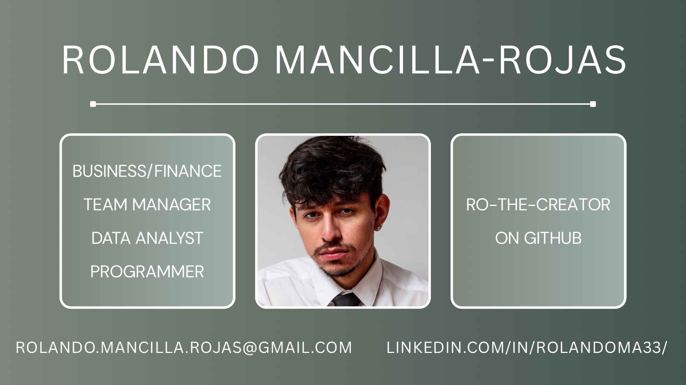

# Welcome to Ro's World 🦝

I'm Ro, and I'm a data analyst studying at The Marcy Lab School! I primarily stay up-to-date with business and finance, although I am also interested in many other fields. This includes music, literature, geography, and many more. If you'd like to connect, reach out to me via email or on my LinkedIn page below!

  &nbsp;
  &nbsp;
  &nbsp;
  &nbsp;
  &nbsp;
  &nbsp;
  &nbsp;
  &nbsp;
  &nbsp;
  &nbsp;
  &nbsp;
  
  &nbsp;
  &nbsp;
  &nbsp;
  &nbsp;
  &nbsp;
  &nbsp;
  &nbsp;
  &nbsp;

## My Info

- rolando.mancilla.rojas [at] gmail.com

- [My LinkedIn](https://www.linkedin.com/in/rolandoma33/)

## Current Project(s)

- [MTA: Beyond the Bus](https://github.com/ro-the-creator/Datathon-MTA-Project)
   - Datathon 2025: A spatial, socio-economic analysis of the MTA Bus Automated Camera Enforcement System. Partnered with MTA.

- [Stock Analyzer Project](https://github.com/ro-the-creator/Stocks-Analysis-Project)
   - Analyzes stock information using yfinance and gives a score based on evaluations.

  
## Past Projects

### The Marcy Lab School
- [Disney+ Business Model Analysis](https://github.com/ro-the-creator/Disney---Streaming-Business-Analysis)
  - Analyzing Disney+ and competing streaming services.

- [Café Le Marcy Financial Analysis & Insights](https://github.com/ro-the-creator/M1-Project--Cafe-Sales)
  - Analyzed Café sales dataset, worked in a team to pull insights.

- [NYC Emergency Data Analysis](https://github.com/ro-the-creator/M2-Final-Project--NYC-Stakeholders)
   - Analyzed Flu/Pneumonia cases across NYC, created Tableau dashboard, presented to DOHMH stakeholders.
 
- [Themepark Analytics](https://github.com/ro-the-creator/M3-Supernova-Analytics)
   - A look into theme park ticket/park revenue, customer satisfaction, etc. Created/Engineered Star Schema in SQLite.

- [Riding the Demand](https://github.com/ro-the-creator/M4-Riding-the-Demand)
   - extracting stakeholder-ready insights from BikeShare data to inform pricing, promos, staffing, and availability.

- [The Green Link](https://github.com/ro-the-creator/M5-The-Green-Link)
   - An analysis of LinkNYC's usage, efficiency, and energy consumption. Found strong links to increased carbon footprint.
 
### Personal
- [Flaskr Blog](https://github.com/ro-the-creator/blog-flask-project)
   - Fullstack. Allows users to register and create blog posts. Created with Flask.

<!--

- [Music Recommendation Project](https://github.com/ro-the-creator/Spotify-Music-Recommendation)
   - Access to Spotify data using spotipy to curate a tailored playlist based on user listening history.

   
**ro-the-creator/ro-the-creator** is a ✨ _special_ ✨ repository because its `README.md` (this file) appears on your GitHub profile.

Here are some ideas to get you started:

- 🔭 I’m currently working on ...
- 🌱 I’m currently learning ...
- 👯 I’m looking to collaborate on ...
- 🤔 I’m looking for help with ...
- 💬 Ask me about ...
- 📫 How to reach me: ...
- 😄 Pronouns: ...
- ⚡ Fun fact: ...
-->
